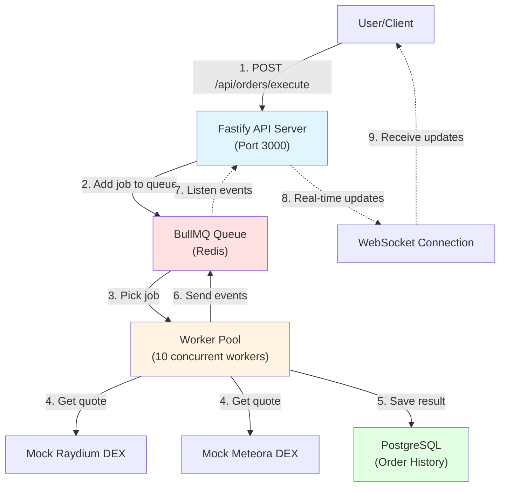
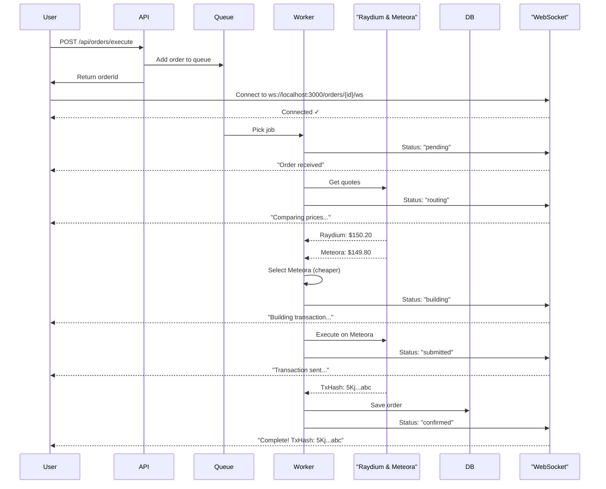
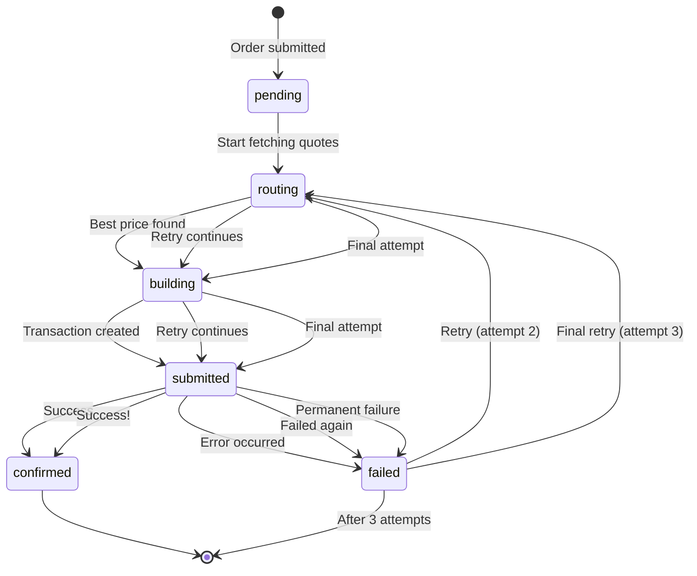

# Eterna Order Execution Engine

A crypto trading engine that automatically finds the best price between two exchanges (Raydium and Meteora) and executes your order in real-time.

## What Does This Do?

You want to buy SOL tokens. Instead of manually checking prices on different exchanges, this system:
1. Checks prices on both Raydium and Meteora
2. Picks the cheaper one
3. Executes your trade
4. Sends you live updates via WebSocket

## Why Market Orders?

**I chose Market Orders because:**
- They execute immediately at current price (simplest to implement and most commonly used)
- No need to wait for a specific price like Limit Orders
- Perfect foundation to build more complex order types

**How to add other order types:**
- **Limit Order**: Add a background job that keeps checking if the price reaches your target, then execute
- **Sniper Order**: Add a listener for new token launches on Solana, then execute immediately when detected

## System Architecture



## Order Flow Diagram



## WebSocket Status Flow



## Quick Start

### Step 1: Install

```bash
git clone https://github.com/nishant-iith/Eterna-backend.git
cd Eterna-backend
npm install
```

### Step 2: Start Services

```bash
# Start Redis and PostgreSQL
docker-compose up -d

# Create database table
docker exec -i eterna-backend-postgres-1 psql -U admin -d order_db < src/db/schema.sql
```

### Step 3: Run the Server

```bash
npm run dev:all
```

Server starts on: `http://localhost:3000`

## How to Use

### 1. Submit an Order

```bash
curl -X POST http://localhost:3000/api/orders/execute \
  -H "Content-Type: application/json" \
  -d '{
    "tokenIn": "SOL",
    "tokenOut": "USDC",
    "amount": 10
  }'
```

**Response:**
```json
{
  "orderId": "7e5af576-49fa-4a19-a3a3-47539d4b5b88",
  "status": "pending",
  "message": "Order queued. Connect to WS for updates."
}
```

### 2. Connect to WebSocket for Live Updates

Open WebSocket connection:
```
ws://localhost:3000/orders/7e5af576-49fa-4a19-a3a3-47539d4b5b88/ws
```

**You'll receive:**
```json
{"status": "connected", "message": "Listening for updates..."}
{"status": "routing", "stage": "Fetching quotes from Raydium & Meteora..."}
{"status": "building", "stage": "Route found: Meteora @ $149.80"}
{"status": "submitted", "stage": "Transaction sent to network"}
{"status": "confirmed", "data": {"txHash": "5Kj...abc", "finalPrice": 149.80, "dex": "Meteora"}}
```

## Tech Stack

| Component | Technology | Why? |
|-----------|-----------|------|
| **Language** | TypeScript | Type safety for financial data |
| **API Server** | Fastify | Fast, built-in WebSocket support |
| **Queue** | BullMQ + Redis | Handles retries, manages concurrent jobs |
| **Database** | PostgreSQL | Reliable storage for order history |
| **Infrastructure** | Docker | Easy local development |

## Key Features

### Smart DEX Routing
- Fetches prices from both Raydium and Meteora
- Automatically picks the best price
- Logs all routing decisions

### Real-time Updates
- WebSocket connection for live status
- See every step: routing → building → submitted → confirmed

### Concurrent Processing
- Handles 10 orders at the same time
- Can process 100+ orders per minute

### Error Handling
- Retries failed orders 3 times
- Exponential backoff: waits 2s, then 4s, then 8s
- Saves error details to database

## Configuration

Create a `.env` file (already included):

```env
# Redis
REDIS_HOST=localhost
REDIS_PORT=6379

# PostgreSQL
POSTGRES_HOST=localhost
POSTGRES_PORT=5432
POSTGRES_USER=admin
POSTGRES_PASSWORD=password
POSTGRES_DB=order_db

# Server
PORT=3000
```

## Project Structure

```
src/
├── db/
│   ├── connection.ts       # Database connection
│   └── schema.sql          # Table structure
├── services/
│   └── mockDex.ts          # Fake Raydium/Meteora (for demo)
├── server.ts               # API + WebSocket
├── worker.ts               # Order processor
└── types.ts                # TypeScript types

docker-compose.yml          # Redis + PostgreSQL setup
```

## Design Decisions

### 1. Why Mock DEX?
Instead of connecting to real blockchain:
- **Faster development** - No network delays
- **Easier testing** - Predictable results
- **Same architecture** - Can swap to real DEX later

### 2. Why Separate WebSocket Endpoint?
Instead of upgrading same HTTP connection:
- **Simpler code** - Clear separation
- **Better testing** - Use any WebSocket client
- **Easier scaling** - Can run on different servers

### 3. Why PostgreSQL?
Instead of MongoDB:
- **Financial data needs ACID** - No data loss
- **Complex queries** - Filter by status, date, DEX, etc.
- **Transactions** - Update orders safely

### 4. Artificial Delay for WebSocket Testing
The worker includes a **2-second delay** at the start:
```typescript
// Artificial delay to test WebSocket (for testing purposes)
await new Promise(resolve => setTimeout(resolve, 2000));
```

**Why?**
- Makes it easier to see WebSocket status updates in real-time
- Without this, orders complete too fast (under 1 second)
- In production with real DEX, natural network latency replaces this
- Can be removed for production deployment

## Database Schema

```sql
orders table:
- id              (auto-increment)
- order_id        (UUID, unique)
- token_in        (e.g., "SOL")
- token_out       (e.g., "USDC")
- amount_in       (e.g., 10.0)
- amount_out      (e.g., 1498.0)
- price           (e.g., 149.80)
- status          (pending/completed/failed)
- tx_hash         (e.g., "5Kj...abc")
- dex_name        (Raydium or Meteora)
- created_at      (timestamp)
```

## Performance

- **Concurrent orders:** 10 at once
- **Speed:** 100+ orders per minute
- **Order time:** 5-7 seconds (with mock DEX)
- **Quote time:** 200-500ms per DEX

## Commands

```bash
npm run dev          # Start API server only
npm run worker       # Start worker only
npm run dev:all      # Start both (recommended)
npm run build        # Compile TypeScript
npm start            # Run production build
```

## Deployment

**Live URL:** _Coming soon_

## Demo Video

**YouTube Link:** _Coming soon_

## Troubleshotas

**Port 3000 already in use:**
```bash
lsof -ti:3000 | xargs kill -9
```

**Docker containers not starting:**
```bash
docker-compose down
docker-compose up -d
```

**Database connection error:**
```bash
# Check if PostgreSQL is running
docker ps | grep postgres
```

## Future Enhancements

- [ ] Add Limit Order support
- [ ] Add Sniper Order support
- [ ] Real Solana devnet integration
- [ ] Order history API endpoint

---

**Built for Eterna Assignment** | [GitHub](https://github.com/nishant-iith/Eterna-backend)
